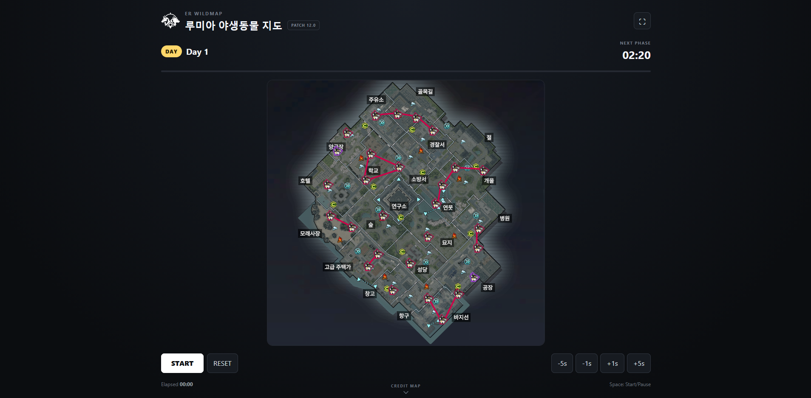
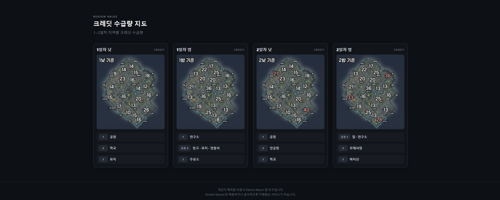

# ER Wildmap

이터널 리턴의 **낮/밤 주기에 따라 늑대와 곰의 위치를 확인하기 위한 비공식 야생동물 지도 도구**입니다.

게임 시작 시 타이머를 직접 시작하면 현재 낮/밤 주기에 맞는 지도를 자동으로 표시합니다.

> 개인 및 지인들과 사용하기 위해 제작한 비영리 프로젝트입니다.

## Website

https://er-wildmap.vercel.app/

## Preview

### Main



### Credit Map



## Features

- 낮/밤 주기에 따른 야생동물 지도 자동 전환
- 늑대 / 곰 위치 확인
- 게임 진행 타이머
- 현재 Day / Night 및 다음 페이즈까지 남은 시간 표시
- 타이머 ±1초 / ±5초 보정
- 지역별 크레딧 지도
- 크레딧 상위 지역 표시
- 지도 확대 모달
- 전체화면 지원
- 키보드 단축키 지원

## Controls

| 키 | 기능 |
|---|---|
| `Space` | 타이머 시작 / 일시정지 |
| `←` / `→` | -1초 / +1초 |
| `Shift + ←` / `Shift + →` | -5초 / +5초 |
| `R` | 타이머 초기화 |
| `F` | 전체화면 |

## How It Works

이 도구는 게임 클라이언트와 직접 연동되지 않습니다.

게임의 프로세스, 메모리, 네트워크 패킷 등을 읽지 않으며 사용자가 게임 시작 시 직접 타이머를 시작하는 독립적인 웹 애플리케이션입니다.

## Tech Stack

- React
- TypeScript
- Vite
- Tailwind CSS
- Vercel

## Development

```bash
npm install
npm run dev
```

프로덕션 빌드:

```bash
npm run build
```

빌드 결과 확인:

```bash
npm run preview
```

## Disclaimer

이 프로젝트는 개인이 제작한 **비공식 Eternal Return 팬 도구**이며, Nimble Neuron과 제휴하거나 공식적으로 지원받는 서비스가 아닙니다.

Eternal Return 및 관련 게임 이미지, 명칭 등의 권리는 해당 권리자에게 있습니다.